# Driving Growth: Identifying Peformance and Behaviour Patterns 
 
An exploratory data analysis of E-List, a digital e-commerce business, examining four years of sales performance, customer behaviour, and product trends, in order to communicate insights to the operations and sales teams.

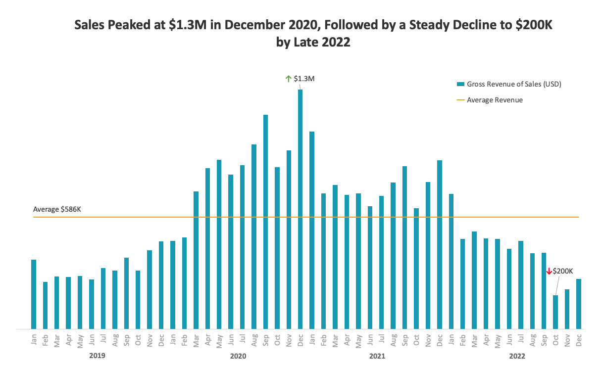

## About the Company

E-List is an American e-commerce company dedicated to the digital marketplace, selling popular elecotronic products. Operating across a diverse product catalogue, E-List serves thousands of customers nationwide, from first-time buyers to loyal repeat customers who return for the quality and convenience the brand is known for. With a focus on growth, customer retention, and delivering measurable value, E-List continues to evolve its offering in an increasingly competitive digital landscape.

## Executive Summary

This project analyses transactional data from 2019 to 2022 to answer key business questions across four areas:
- **Sales Trends**  
  Monthly and yearly sales volume and revenue, tracking the rise and peak in 2020 and the subsequent decline through 2022
  
- **Average Order Value (AOV)**  
  How AOV evolved over time and how it differs between loyalty and non-loyalty program members
- **Customer Retention**    
  Identifying returning customers, their spend behaviour, and relationship with the loyalty program
  
- **Product & Geography Performance**   
  Which products and regions drove growth, and where refund rates were highest
  
- **Seasonality**   
  Best and worst performing months across the four-year period

## Table of Contents
1. [Data and Scope](#data-and-scope)
2. [Key Findings and Insights](#key-findings-and-insights)
    2.1. [Monthly and Yearly Trends](#monthly-and-yearly-trends)         
    2.2. [Seasonal Trends](#seasonal-trends)      
    2.3. [Product Trends](#product-trends)     
    2.4. [Geographical Trends](#geographical-trends)     
    2.5. [Refund Rates](#refund-rates)    
    2.6. [Refund Rates: Apple Products Focus](#refund-rates-apple-products-focus)         
    2.7. [Loyalty Program](#loyalty-program)               
4. [Recommendations for Stakeholders](#recommendations-for-stakeholders)
5. [Limitations and Next Steps](#limitations-and-next-steps)

## Data and Scope

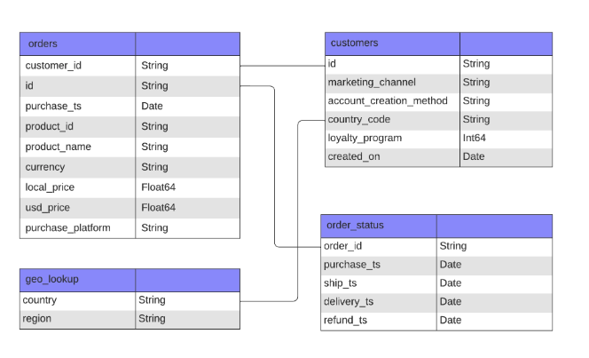

## Key Findings and Insights

### Monthly and Yearly Trends

### Seasonal Trends

<table>
    <tbody>
    <tr>
      <td>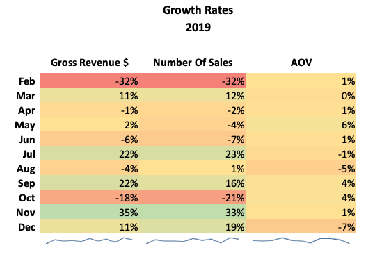</td>
      <td>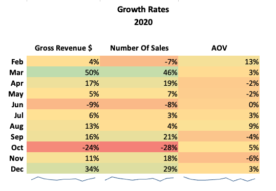</td>
    </tr>
    <tr>
      <td>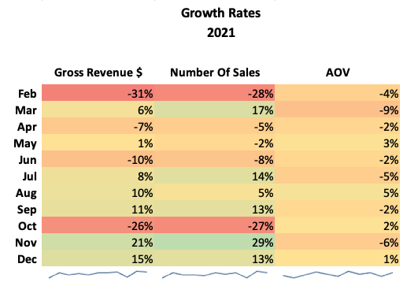</td>
      <td>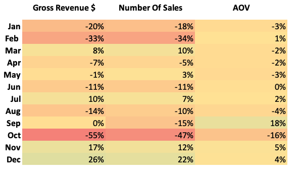</td>
    </tr>
  </tbody>
</table>

### Product Trends

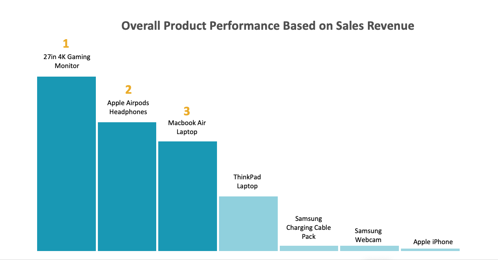

### Geographical Trends

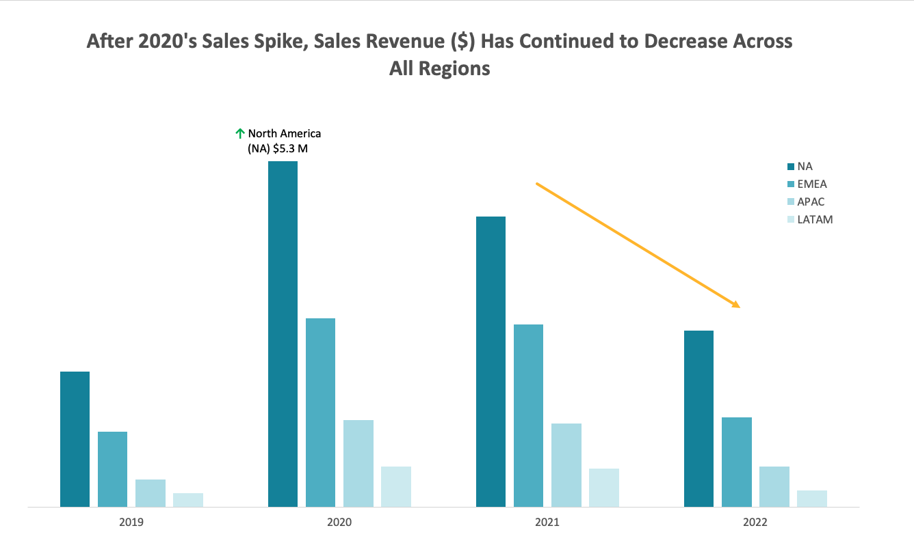

### Refund Rates

<table>
    <tbody>
    <tr>
      <td>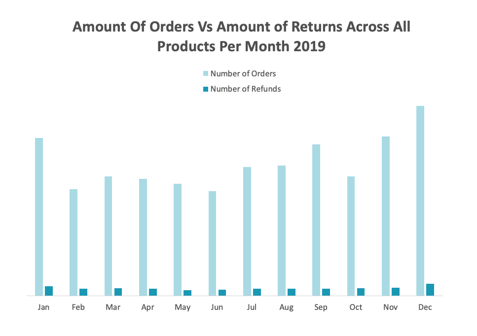</td>
      <td>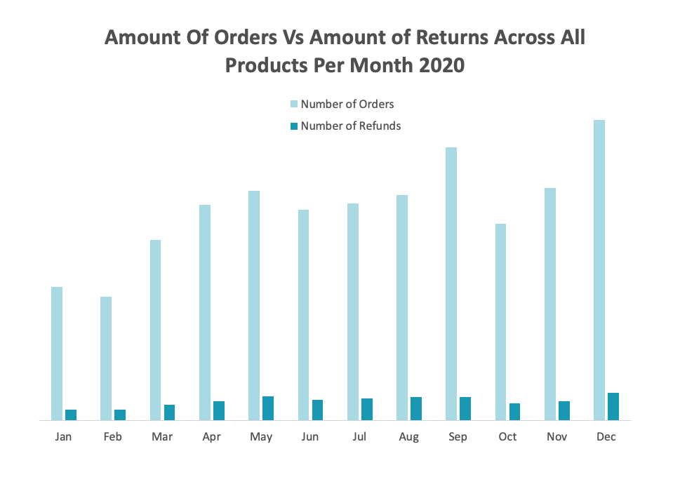</td>
    </tr>
    <tr>
      <td>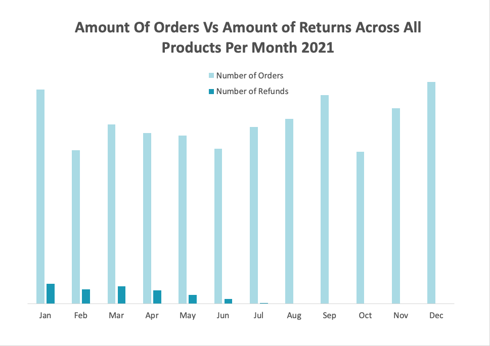</td>
      <td>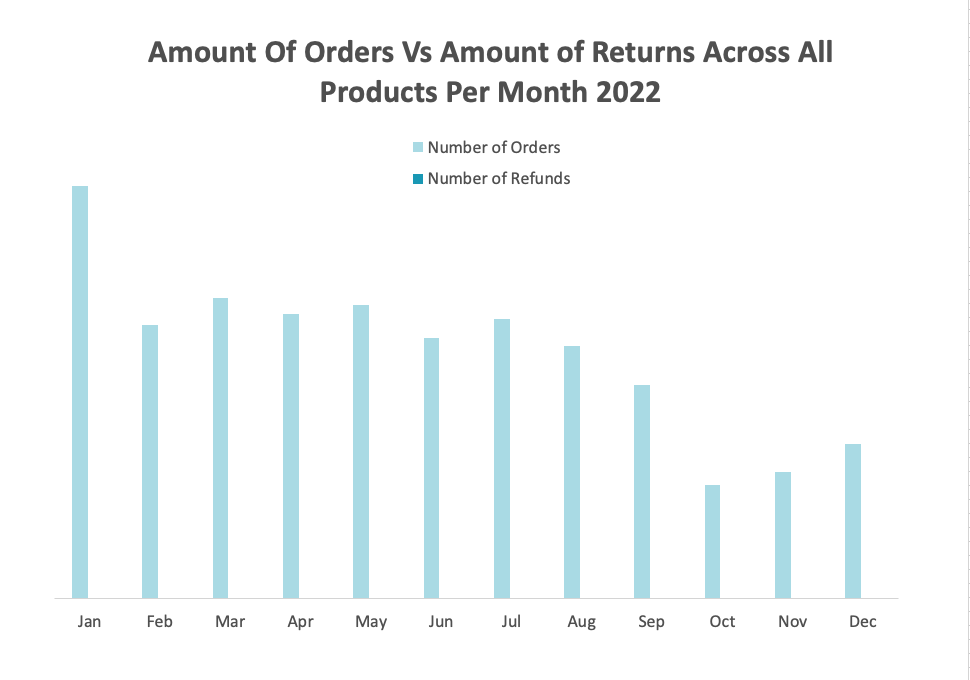</td>
    </tr>
  </tbody>
</table>

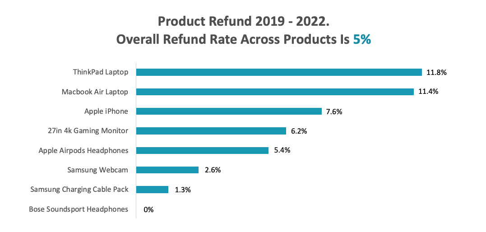

### Refund Rates: Apple Products Focus

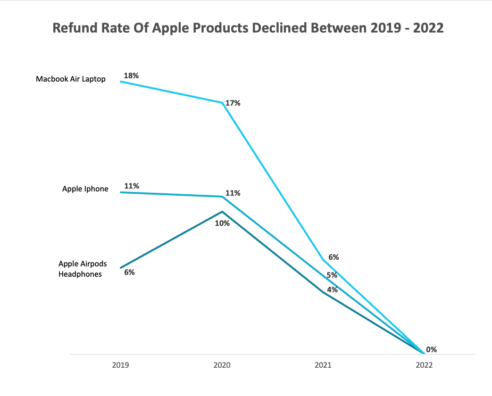

### Loyalty Program

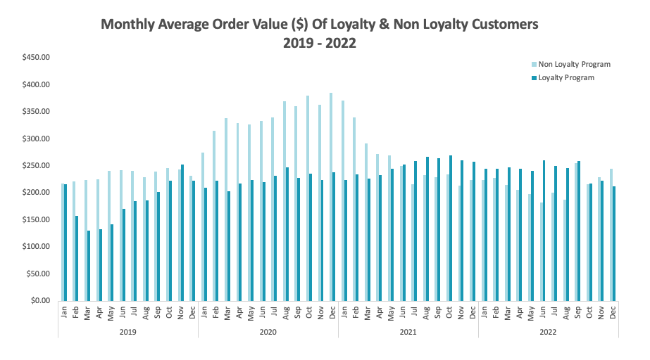
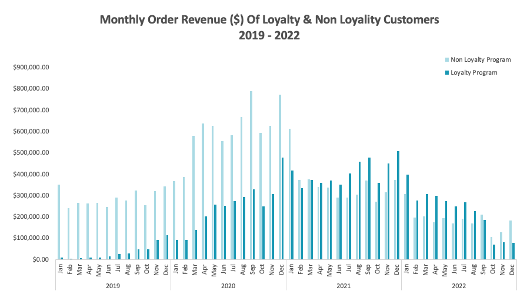

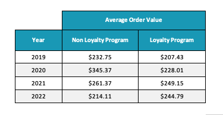

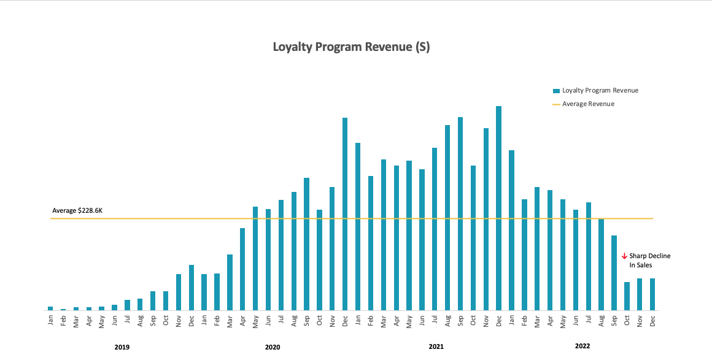

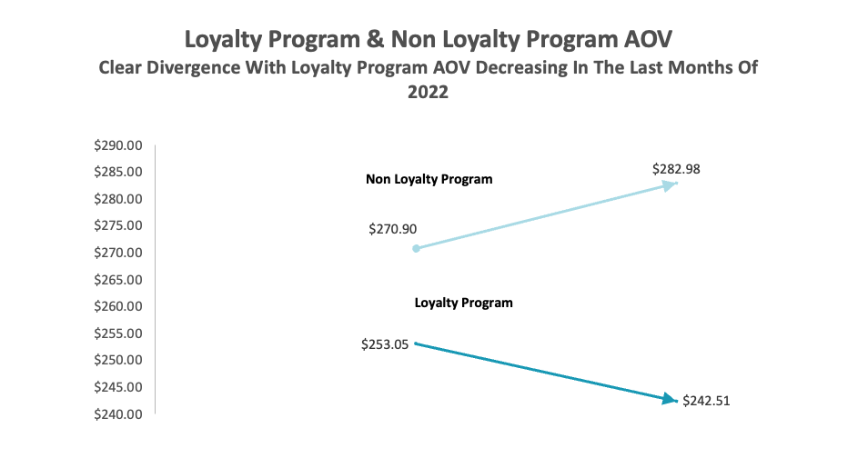

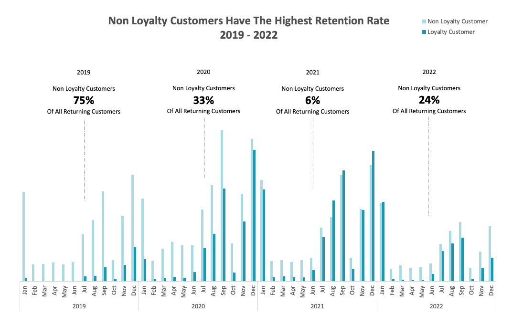

## Recommendations for Stakeholders

## Limitations and Next Steps

### Limitations

### Next Steps
