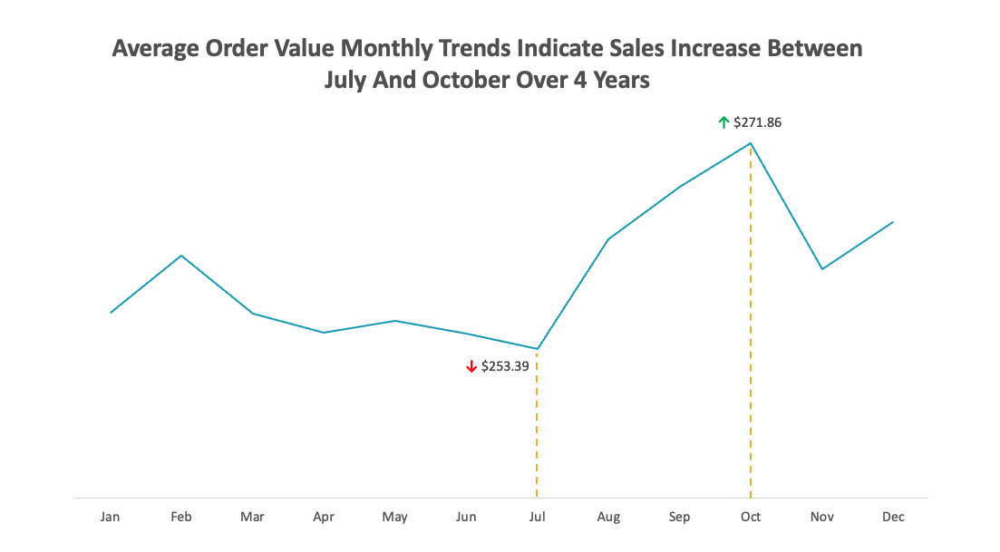
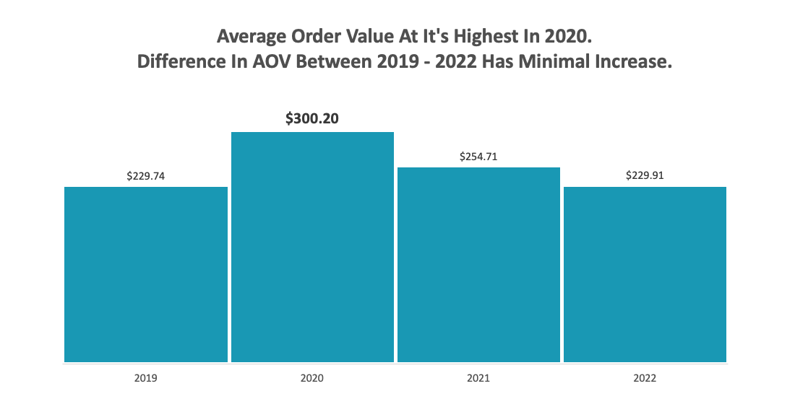
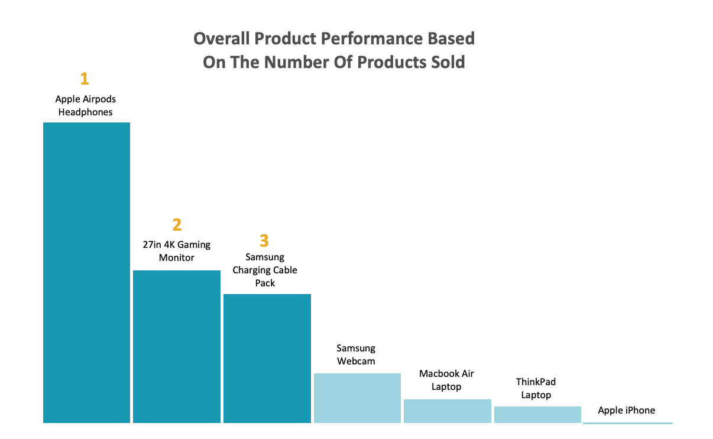
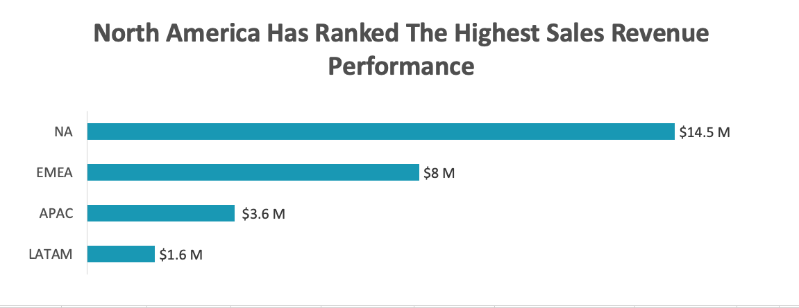
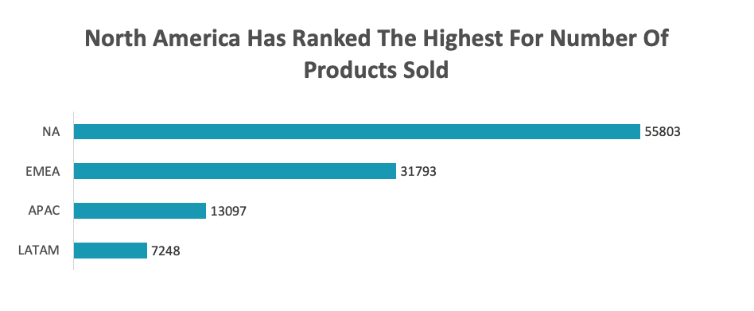
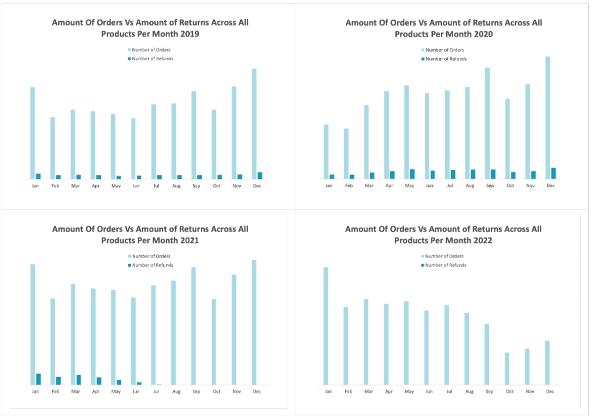

# Driving Growth: E-Commerce Analysis Identifying & Improving Sales Performance and Customer Retention

An exploratory data analysis of E-List, a digital e-commerce business, examining four years of sales performance, customer behaviour and product and program trends, in order to find and communicate key insights and recommendations to the operations and sales stakeholders.

## About the Company

E-List is an American e-commerce company dedicated to the digital marketplace, selling popular elecotronic products. Operating across a diverse product catalogue, E-List serves thousands of customers nationwide, from first-time buyers to loyal repeat customers who return for the quality and convenience the brand is known for. With a focus on growth, customer retention, and delivering measurable value, E-List continues to evolve its offering in an increasingly competitive digital landscape.

## Executive Summary

This report presents a four-year analysis (2019–2022) of E-List's Nortstar Metrics: sales performance, customer behaviour, product trends, and regional distribution, with the goal of identifying growth opportunities, retention risks, and operational inefficiencies.

### Key Findings

<table>
 <tbody>
  <tr>
   <td width="50%">
     
    <b>Sales Trends</b>     
    <ul>
    <li>
     Total revenue peaked in <b>December 2020 at $1.3M</b>, driven by pandemic-accelerated digital adoption, before entering a sustained decline through 2021–2022.
    </li>
    <li>The <b>monthly average revenue across the period was $586K</b>, with a consistent seasonal uplift in <b>Q3–Q4 (September–November)</b> observed across all four years.</li>
    <li>AOV remained relatively stable between <b>$207–$345</b>, with 2020 figures inflated by pandemic conditions and not reflective of underlying business performance.</li>
   </ul>
   <b>Product Performance</b>     
    <ul>
    <li>
     The <b>27in Gaming Monitor, Apple AirPods, and MacBook Air</b> are the top three revenue-generating products.
    </li>
    <li>The <b>Apple iPhone underperforms</b> on both revenue and units sold despite an Apple-aligned customer base.</li>
    <li>Laptop refund rates <b>(ThinkPad 11.8%, MacBook Air 11.4%)</b> are more than double the portfolio average of 5% and represent the most significant refund risk.</li>
   </ul>
    <b>Geography</b>     
    <ul>
    <li>
     <b>North America leads</b> with $14.5M in revenue and 55,803 orders, which is nearly double than EMEA, the next largest region, at $8M.
    </li>
    <li>EMEA presents the strongest near-term growth opportunity given comparable AOV to North America.</li>
    <li>APAC and LATAM remain underdeveloped markets requiring localisation investment before meaningful growth is achievable.</li>
   </ul>
     
   </td>
   <td>
    <b>Loyalty Program</b>     
    <ul>
    <li>
     The loyalty program demonstrates <b>good retention impact</b> — by 2021–2022, members fall only 6% behind non-member for returning customers.
    </li>
    <li>However, loyalty members have historically spent <b>less per order</b> than non-loyalty customers, suggesting the program is capable of retains but does not sufficiently incentivise higher spend.</li>
    <li><b>2022 is the first year loyalty AOV exceeded non-loyalty AOV</b>. An early positive signal that warrants close monitoring.</li>
   </ul>
   <b>Refund Rates</b>     
    <ul>
    <li>
     The overall refund rate of<b> 5% is healthy</b> and has been declining since the pandemic-era spike in 2020–2021.
    </li>
    <li>Laptop refund rates remain an outlier and require targeted investigation into product descriptions, customer expectations, and post-purchase experience.</li>
   </ul>
     
      
      
     
     
     
     
     
     
     
     
     
     
   </td>
  </tr>
 </tbody>
</table>

## Table of Contents

1. [Data and Scope](#data-and-scope)
2. [Key Findings and Insights](#key-findings-and-insights)  
   2.1. [Monthly and Yearly Trends](#monthly-and-yearly-trends)  
   2.2. [Seasonal Trends](#seasonal-trends)  
   2.3. [Product Trends](#product-trends)  
   2.4. [Geographical Trends](#geographical-trends)  
   2.5. [Refund Rates](#refund-rates)  
   2.6. [Refund Rates: Apple Products Focus](#refund-rates-apple-products-focus)  
   2.7. [Loyalty Program](#loyalty-program)
3. [Recommendations for Stakeholders](#recommendations-for-stakeholders)

## Data and Scope

This project uses E-List's order dataset, presented as an excel file. A structured dataset of over 10,800 entries, containing the following segments:

- Customer Information
- Orders
- Order Status
- Geography

## Key Findings and Insights

### Monthly and Yearly Trends

<table>
   <tbody>
    <tr>
      <td>
        
       <b>Key Findings</b>      
       <ul>
        <li>
         <b>AOV consistently increases</b> every year during Q3 (July–October), with an average uplift of approximately $20. 
        </li>
        <li>
         This <b>pattern repeats across all four years</b>, suggesting a structural seasonal trend rather than a one-off event.
        </li>
       </ul>
         
      </td>
      <td>
         
       <b>Recommendations</b> 
       <ul>
        <li>
          Invest in targeted marketing campaigns ahead of July to <b>capitalise on the natural uplift</b> already present in the data..
        </li>
        <li>
         <b>Introduce Q3 specific bundles</b> 
         Since customers are already spending more, bundling products at a slight premium could push AOV even higher.
        </li>
       </ul>
        
      </td>
    </tr>
   </tbody>
</table>

<table>
   <tbody>
    <tr>
      <td>
        
       <b>Key Findings</b> 
       <ul>
        <li>
         <b>AOV peaked in 2020</b> at $300.20, coinciding with the height of the Covid-19 pandemic.
        </li>
        <li>
         Following the peak, AOV declined steadily, returning close to pre-pandemic 2019 levels by 2022.
        </li>
        <li>
         The pattern suggests the <b>AOV spike was driven by external pandemic conditions</b>, increased digital dependency, remote work; rather than any internal shift in sales or marketing strategy.
        </li>
       </ul>
         
      </td>
      <td>
       <b>Recommendations</b> 
       <ul>
        <li>
         <b>Don't benchmark against 2020</b>. Using peak pandemic figures as a performance target would be misleading; 2019 figures are a more realistic baseline for future planning.
        </li>
        <li>
         <b>Develop a retention strategy for pandemic-era customers</b>. Many customers acquired in 2020 may have lapsed; a re-engagement campaign targeting this cohort could recover some of that lost AOV.
        </li>
       </ul>
        
         
      </td>
    </tr> 
   </tbody>
</table>

 

 

### Seasonal Trends

#### Monthly Growth Over 4 Years

 

#### Top Performing Months

<table>
 <tbody>
   <tr>
     <td width="50%">
       
      
<b>Key Findings </b>

      <ul>
       <li>
        A strong and consistent <b>Fall/Autumn seasonal trend</b> is evident across all four years. Gross Revenue, Number of Sales, and AOV all peak during this period, <b>spanning the end of Q3 through early Q4 (September– November).</b>
       </li>
       <li>
        <b>November and December</b> are the most consistently high-performing months across all metrics and all years, driven by end-of-year consumer spending behaviour.
       </li>
       <li>
July appears repeatedly as a strong performer for both revenue and sales volume, reinforcing the Q3 uplift identified in the AOV trend analysis.
        </li>
       <li>
<b>The March 2020 spike</b> (Gross Revenue +50%, Sales +46%) is a clear outlier driven by Covid-19 pandemic conditions and should be <b>excluded from seasonal benchmarking</b> to avoid distorting performance patterns.
       </li>
      </ul>
       
     </td>
    <td>
       
      
<b>Year by Year Highlights </b>

     <ul>
      <li>
      <b>2019</b> — Growth was driven by a strong Q4 with November delivering the highest single-month revenue growth at <b>+35%</b>, consistent with pre-pandemic consumer behaviour.
      </li>
      <li>
       <b>2020</b> — March dominates due to pandemic conditions. Excluding March, December (+34%) emerges as the true seasonal peak, consistent with other years.
      </li>
      <li>
       <b>2021</b> — November and December reassert themselves as the top performers, suggesting a <b>return to normalcy</b> in seasonal buying patterns post-pandemic peak.
      </li>
      <li>
       <b>2022</b> — The seasonal pattern holds with December (+26%) and November (+17%) leading, though overall growth rates are lower reflecting the broader declining revenue trend.
      </li>
     </ul>
      
      
      
    </td>
   </tr>
 </tbody>
</table>

#### Worst Performing Months

<table>
 <tbody>
   <tr>
     <td width="50%">
       
      
<b>Key Findings </b>

      <ul>
       <li>
        <b>February and October</b> are the most consistently worst-performing months across all four years for both Gross Revenue and Number of Sales.
       </li>
       <li>
        February underperformance is likely structural, as it is the <b>shortest month</b> and sits in a post-holiday spending lull following January.
       </li>
       <li>
       October is a recurring weak spot despite sitting within the broader Q3–Q4 strong period, suggesting a <b>mid-season dip</b> before the November–December surge.
       </li>
      </ul>
       
     </td>
     <td>
       
      <ul>
      <li>
        January frequently appears as a poor performer, consistent with post-holiday consumer spending fatigue.
        </li>
        <li>
         <b>AOV remains relatively stable</b> throughout the year. The range across four years sits between <b>-16% and +18%</b>, indicating that while customers buy less frequently in weaker months, those who do purchase spend a <b>similar amount per order</b>.
        </li>
        <li>
         This is a significant insight, as it shows the revenue problem in slow months is a <b>volume problem, not a value problem</b>.
        </li>
      </ul>
       
       
       
    </td>
   </tr>
  </tbody>
</table>

#### Observations & Recommendations

<table>
 <tbody>
   <tr>
     <td width="50%">
       
      
<b>Lean into the seasonal peak early </b>

      <ul>
       <li>
        Begin Q3–Q4 marketing campaigns in late August to capture early seasonal demand before the November rush.
       </li>
       <li>
        Given July's consistent strength, a mid-year summer promotion could extend the peak window further into Q3.
       </li>
      </ul>
       
      
<b>Address the February and October slumps directly </b>

      <ul>
       <li>
        Introduce limited-time offers or loyalty incentives in February and October to stimulate volume. Since AOV holds steady, even a modest increase in order numbers would meaningfully lift revenue.
       </li>
       <li>
        Consider email re-engagement campaigns targeting lapsed customers in January to front-load Q1 before the February dip hits.
       </li>
      </ul>
       
     </td>
     <td>
       
      
<b>Use AOV stability as leverage </b>

      <ul>
      <li>
        Since AOV doesn't fluctuate significantly across seasons, focus retention and upsell strategies on increasing purchase frequency, rather than pushing customers to spend more per order.
        </li>
        <li>
         A loyalty reward that incentivises a second purchase within 60 days could be particularly effective during traditionally slow months.
        </li>
      </ul>
      
<b>Exclude March 2020 from all benchmarking</b>

      <ul>
      <li>Flag this data point clearly in all reporting. Using it as a growth target would set unrealistic expectations and misrepresent true seasonal patterns.
      </li>
      <li>Use 2019 and 2021 as the most reliable baseline years for seasonal benchmarking, as they are least distorted by external events.
      </li>
      </ul>
       
    </td>
   </tr>
  </tbody>
</table>

 

 

### Product Trends

#### Sales Revenue vs. Units Sold. Top & Bottom Performers

#### Key Findings

<table width="100%">
   <tbody>
    <tr>
     <td width="50%">
      <ul>
      <li>
       There is a <b>near-perfect rank reversal</b> between the top two products when switching from revenue to volume. The <b>27in 4K Gaming Monitor</b> leads on revenue while <a>Apple AirPods Headphones</a> leads on units sold. This is expected given the significant price difference between the two products.
      </li>
       <li>
        The <b>top 3 products by revenue</b> (27in 4K Gaming Monitor, Apple AirPods, MacBook Air Laptop) account for the majority of total revenue, indicating a concentrated revenue dependency on a small number of high-value products.
       </li>
      </ul>
       
     </td>
     <td width="50%">
       
      <ul>
       <li>
        The <b>Samsung Charging Cable Pack</b> jumps from 5th in revenue to 3rd in units sold, a classic high-volume, low-margin product that drives transaction count but contributes less to overall revenue.
       </li>
      <li>
     The <b>iPhone</b> consistently sits at the bottom across both revenue and units sold, suggesting either a <b>pricing, visibility, or product-market fit issue</b> that is worth investigating further.
      </li>
      <li>
      The<b> MacBook Air Laptop</b> and <b>ThinkPad Laptop</b> rank higher on revenue than units sold, confirming they are high-value, <b>lower-frequency purchases</b>.
      </li>
      </ul>
       
     </td>
    </tr>
   </tbody>
</table>

#### Observations & Recommendations

<table width="100%">
   <tbody>
    <tr>
     <td width="50%">
       
<b>Protect the top 3 revenue drivers </b>

      <ul>
      <li>
       The 27in 4K Gaming Monitor, Apple AirPods, and MacBook Air Laptop are our top performers. Ensure these products have <b>strong inventory availability, prominent placement, and are included in any loyalty rewards</b>.
      </li>
       <li>
        Any decline in these three products would have an <b>outsized impact on total revenue</b>.
       </li>
      </ul>
      
<b>Leverage the Charging Cable as a cross-sell tool </b>

      <ul>
      <li>
      Its high sales volume but lower revenue contribution makes it an ideal add-on or <b>bundling product</b>.
      </li>
       <li>
        Pair it at checkout with the 27in 4K Gaming Monitor, MacBook Air Laptop, or iPhone to increase AOV without requiring the customer to actively seek it out.
       </li>
      </ul>
       
       
     </td>
     <td>
       
      
<b>Investigate the iPhone underperformance </b>

      <ul>
       <li>
        The iPhone ranking last on both metrics is a problematic. Particularly given Apple AirPods and MacBook Air perform strongly, suggesting the customer base is <b>Apple-aligned</b>.
       </li>
      <li>
     Possible causes: pricing uncompetitive vs. carriers or other retailers, low product visibility, or limited digital product appeal compared to physical retail alternatives..
      </li>
      <li>
      Recommend a <b>pricing review and visibility audit</b> for the iPhone listing.
      </li>
      </ul>
      
<b>Balance the product portfolio </b>

      <ul>
       <li>
       The business currently leans heavily on a few high-ticket items. Introducing <b>mid-range digital products </b> could broaden the revenue base and reduce dependency on the top 3
       </li>
       <li>
       The Webcam's mid-table position on both metrics suggests untapped potential, particularly given the sustained remote and hybrid working trend post-pandemic.
       </li>
      </ul>
       
     </td>
    </tr>
   </tbody>
</table>

 

 

### Geographical Trends

#### Revenue & Order Volume by Region (2019–2022)

<table width="100%">
   <tbody>
    <tr>
     <td>
       
       
<b>Key Findings </b>

      <ul>
       <li>
        <b>North America dominates</b> across both revenue and order volume, generating <b>$14.5M in revenue</b> and <b>55,803 orders</b>, surpassing all other regions combined.
       </li>
       <li>
        Despite the post-2020 decline affecting all regions, <b>2020 revenue still outperforms 2019 across every region</b>, suggesting the pandemic accelerated digital product adoption globally, not just in North America.
       </li>
       <li>
        The <b>regional revenue hierarchy is consistent</b> across both metrics: NA > EMEA > APAC > LATAM , indicating this is a structural market position rather than a product or campaign-specific outcome.
       </li>
      </ul>
       
    </td>
   </tr>
 </tbody>
</table>
       

#### Deeper Observations

<table width="100%">
   <tbody>
    <tr>
     <td width="50%">
       
       
<b>North America </b>

       <ul>
       <li>NA's dominance is expected given E-List is an American company with likely stronger brand recognition, localised marketing, and USD-native pricing.</li>
        <li>However, <b>heavy revenue concentration in one region is a business risk</b>. Any market downturn, increased competition, or regulatory change in NA would have an outsized impact on total performance.</li>
        <li>NA's scale means even marginal improvements in retention or AOV yield significant revenue gains.</li>
       </ul>
       
<b>EMEA </b>

       <ul>
       <li>EMEA is the <b>strongest secondary market</b> at $8M; roughly half of NA's revenue but with a comparable AOV of ~$252, suggesting customers in this region spend similarly per order when they do buy.</li>
        <li>The gap is more likely a <b>volume problem than a value problem</b>. EMEA customers spend comparably but there are fewer of them.</li>
        <li>This makes EMEA the most immediately actionable growth region, as the purchasing behaviour is already there.</li>
       </ul>
       
     </td>
     <td width="50%">
       
<b>APAC </b>

       <ul>
       <li>APAC shows the <b>highest estimated AOV at ~$275</b>, which is notable given its relatively low order volume.</li>
        <li>This suggests a smaller but <b>higher-spending customer base</b>, potentially an underpenetrated premium market rather than a low-opportunity one.</li>
        <li>Language, localisation, and payment method barriers may be suppressing volume despite genuine purchase intent.</li>
       </ul>
       
<b>LATAM </b>

       <ul>
       <li>LATAM is the smallest region by both metrics and has the <b>lowest AOV at ~$221.</b></li>
        <li>Requires the most investment to develop and carries the highest risk relative to short-term return.</li>
       </ul>
       
       
       
       
       
       
     </td>
    </tr>
   </tbody>
</table>

#### Where to Focus?

<table width="100%">
   <tbody>
    <tr>
     <td width="50%">
       
       
<b>Tier 1: Optimise North America </b>

       <ul>
       <li>Focus on <b>retention, loyalty program engagement, and AOV growth</b> rather than new customer acquisition, which is costlier and subject to diminishing returns in a mature market.</li>
        <li>Even a <b>5% AOV increase in NA</b> would generate more revenue than doubling LATAM entirely.</li>
       </ul>
       
<b>Tier 2: Invest in EMEA </b>

       <ul>
        <li>The gap is more likely a <b>volume problem than a value problem</b>. EMEA customers spend comparably but there are fewer of them.</li>
        <li>Lowest risk, highest probability of return among the growth regions.</li>
       </ul>
            
     </td>
     <td width="50%">
         
       
<b>Tier 3: Test and Learn in APAC </b>

       <ul>
       <li>Run <b>small-scale localised campaigns</b> in highest-potential APAC markets to test demand before committing budget.</li>
        <li>Focus on removing friction: <b>local payment methods, language support, and regional customer service.</b></li>
       </ul>
       
<b>Tier 4: Short Term Deprioritization of LATAM </b>

       <ul>
       <li>With the lowest revenue, lowest AOV, and highest structural barriers, LATAM should not be a near-term priority.</b></li>
        <li>Monitor organically and revisit once NA, EMEA, and APAC strategies are established.</li>
       </ul>
       
       
       
       
     </td>
    </tr>
   </tbody>
</table>

 

 

### Refund Rates

#### Overall Refund Trends (2019–2022)

<table>
 <tbody>
  <tr>
   <td>
     
    <ul>
      <li>The <b>overall refund rate across four years was 5%</b> — a healthy figure for an e-commerce business and broadly in line with industry benchmarks for digital products</li>
      <li>Refund rates <b>increased through 2020 into early 2021</b>, likely reflecting the influx of pandemic-driven purchases from less engaged or first-time buyers who may not have been the core target customer</li>
      <li>By <b>late 2021, refund rates normalised</b> and continued declining into 2022 — consistent with the broader post-pandemic sales contraction reducing volume-driven refund noise</li>
    </ul>
     
   </td>
  </tr>
 </tbody>
</table>

#### Refund Rates by Product

<table>
 <tbody>
  <tr>
   <td>
     
    <ul>
      <li>
       <b>Laptops carry the highest refund rates</b>. ThinkPad Laptop at 11.8% and MacBook Air Laptop at 11.4% are notably above the portfolio average of 5%. For high-ticket items, this warrants investigation.</b>
      </li>
      <li><b>Lower-value accessories (Charging Cable, Webcam, Bose Headphones)</b> have negligible refund rates, suggesting customers are satisfied with simpler, lower-risk purchases.</li>
      <li>The <b>Bose Soundsport Headphones at 0%</b> is a standout. It is worth understanding what drives that satisfaction to apply lessons elsewhere.</li>
    </ul>
     
   </td>
  </tr>
 </tbody>
</table>

#### Is the Refund Rate a Problem?

<table>
 <tbody>
  <tr>
   <td>
     
    The overall 5% rate is low, the pandemic period skewed the figures temporarily, and the trend is clearly improving. However, the laptop category at ~11% deserves focused attention regardless of the overall health of the portfolio.It is more than double the average and involves the highest-value products. A targeted review of laptop product descriptions, customer feedback, and post-purchase support would be worthwhile. 
     
   </td>
  </tr>
 </tbody>
</table>

 

 

### Refund Rates: Apple Products Focus

<table>
 <tbody>
  <tr>
   <td width="65%">
    
   </td>
   <td>
    <ul>
      <li>
       Apple product refund rates ranged from <b>6%–18% in 2019</b>, dropping significantly to <b>4%–6% by 2021</b> and reaching <b>0% in 2022</b>
      </li>
      <li>This sharp improvement likely reflects a combination of <b>better product listings, improved customer targeting post-pandemic, and a more engaged buyer base</b> as impulse pandemic purchases faded. </li>
    </ul>
   </td>
  </tr>
 </tbody>
</table>

 

 

### Loyalty Program

<table>
 <tbody>
  <tr>
   <td>
     
    <ul>
      <li>
       For <b>2019–2021, Non-Loyalty customers consistently had a higher AOV</b> than Loyalty members. A counterintuitive finding that suggests the loyalty program was not successfully driving higher spend per order.
      </li>
      <li><b>2022 is the first year Loyalty AOV exceeded Non-Loyalty AOV</b> ($244.79 vs. $214.11), which could indicate the program is beginning to mature and influence spending behaviour. However, this coincides with overall declining sales.</li>
    </ul> 
   </td>
  </tr>
 </tbody>
</table>

<table>
 <tbody>
  <tr>
   <td>
     
      The <b>last 6 months of 2022</b> show an upward AOV trend for Non Loyalty Program Customers, where Loyalty Program Members AOV declines. 
     
   </td>
  </tr>
 </tbody>
</table>

<table>
 <tbody>
  <tr>
   <td>
     
    <ul>
     <li>
     The most striking finding is that <b>non-loyalty customers dominated returning customer behaviour in 2019 at 75%</b>, before loyalty program retention improved significantly through 2021.
     </li>
     <li>
      The more important question this raises is: <b>why were non-loyalty customers returning at such high rates in 2019?</b> Was this cohort returning without any formal incentive? Understanding what motivated them could unlock organic retention strategies.
     </li>
    </ul> 
   </td>
  </tr>
 </tbody>
</table>

#### Should the Loyalty Program Continue?

<table>
 <tbody>
  <tr>
   <td>
     
    <ul>
     <li>
     The loyalty program <b>was showing significant retention improvement in 2021</b>, nearly surpasses non-loyalty customers. Looking into what impacted this increase in retention would be beneficial.
     </li>
     <li>
      It is <b>not yet working for AOV</b>. Loyalty members historically spent less per order than non-members, though 2022 shows early signs of this reversing.
     </li>
    </ul> 
   </td>
  </tr>
 </tbody>
</table>

## Recommendations for Stakeholders

### Sales Trends

<table>
 <tbody>
  <tr>
   <td>
     
    <ul>
     <li>
     Sales peaked in <b>December 2020 driven by pandemic conditions</b> and have been in steady decline since. <b>Do not use 2020 as a performance benchmark.</b>
     </li>
     <li>
     Focus on defending and growing the <b>Q3–Q4 seasonal window</b>, which consistently drives the strongest performance across all years.
     </li>
     <li>
     Target <b>February and October</b> with tactical promotions to address the recurring revenue dips in these months.
     </li>
    </ul> 
   </td>
  </tr>
 </tbody>
</table>

### Product Strategy

<table>
 <tbody>
  <tr>
   <td>
     
    <ul>
     <li>
     <b>Protect the top 3 revenue drivers</b>: Gaming Monitor, AirPods, and MacBook Air. These products carry the business and any decline would have a negative impact.
     </li>
     <li>
     <b>Bundle the Charging Cable</b> at checkout with high-ticket items to lift AOV passively.
     </li>
     <li>
     Conduct an urgent <b>product and pricing review for the iPhone</b>. It underperforms on every metric despite sitting in a strong Apple-aligned customer base.
     </li>
     <li>
      Investigate <b>laptop refund rates</b>.At ~11%, ThinkPad and MacBook Air refunds are a revenue leak on the highest-value products in the portfolio.
     </li>
    </ul> 
   </td>
  </tr>
 </tbody>
</table>

### Geography

<table>
 <tbody>
  <tr>
   <td>
     
    <ul>
     <li>
     <b>Focus on North America</b>. It generates nearly 53% of total revenue; retention and AOV optimisation here will always outperform growth investment elsewhere in the short term.
     </li>
     <li>
     <b>Invest selectively in EMEA</b>. Comparable AOV to NA with lower volume suggests a marketing and reach problem, not a product-market fit problem.
     </li>
     <li>
     <b>Run small-scale pilots in APAC</b> before significant investment. The high AOV signals opportunity but the market requires localisation.
     </li>
    </ul> 
   </td>
  </tr>
 </tbody>
</table>

### Loyalty Program — Should It Continue?

The recommendation is not to abandon the program but to restructure it around two clear goals it is currently not achieving.

<table>
 <tbody>
  <tr>
   <td>
     
    <ul>
     <li>
    <b>Increase AOV for loyalty members</b>. Introduce tiered rewards that unlock at higher spend thresholds rather than rewarding repeat visits alone. Customers should be incentivised to spend more, not just return more.
     </li>
     <li>
     <b>Re-engage the organic returners</b>. The non-loyalty customers who returned at high rates in 2019 represent a valuable untapped segment. Understanding and replicating what drove their return behaviour could significantly boost retention without loyalty program overhead.
     </li>
     <li>
     <b>Monitor the 2022 AOV reversal closely</b>. If loyalty AOV continues to outpace non-loyalty into 2023, it would validate the program's long-term trajectory and justify continued investment.
     </li>
    </ul> 
   </td>
  </tr>
 </tbody>
</table>

### Refund Rates

<table>
 <tbody>
  <tr>
   <td>
     
    <ul>
     <li>
    The<b>overall 5% refund rate is healthy</b> and trending in the right direction.
     </li>
     <li>
     Focus refund reduction efforts specifically on <b>laptops</b> where rates are more than double the portfolio average.
     </li>
     <li>
     Use the <b>Bose Soundsport 0% refund rate</b> as a case study. What about that product's listing, description, or customer experience drives zero returns?
     </li>
    </ul> 
   </td>
  </tr>
 </tbody>
</table>
