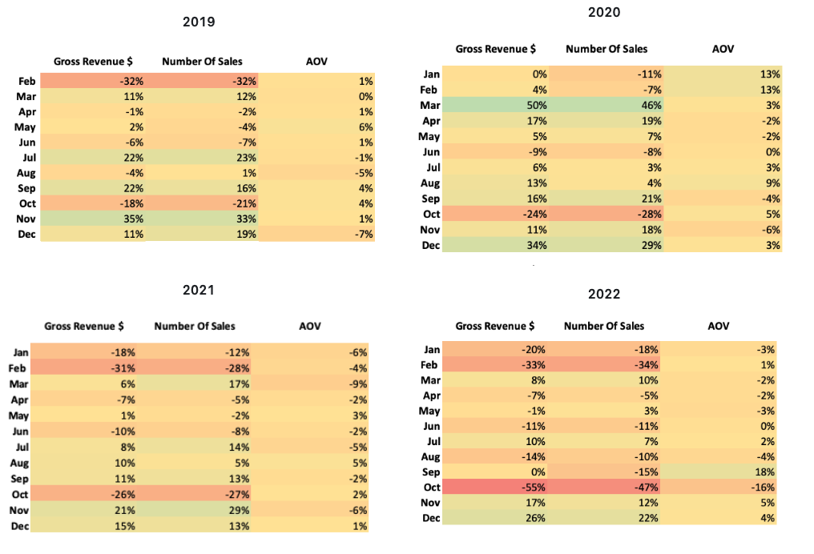

# Driving Growth: E-Commerce Analysis Identifying & Improving Sales Peformance and Customer Retention
 
An exploratory data analysis of E-List, a digital e-commerce business, examining four years of sales performance, customer behaviour, product  and program trends, in order to find and communicate key insights and recommendations to the operations and sales stakeholders.

## About the Company

E-List is an American e-commerce company dedicated to the digital marketplace, selling popular elecotronic products. Operating across a diverse product catalogue, E-List serves thousands of customers nationwide, from first-time buyers to loyal repeat customers who return for the quality and convenience the brand is known for. With a focus on growth, customer retention, and delivering measurable value, E-List continues to evolve its offering in an increasingly competitive digital landscape.

## Executive Summary

This project analyses transactional data from 2019 to 2022 to answer key business questions across five areas:  

1. **Sales Trends**  
  Monthly and yearly sales volume and revenue, tracking the rise and peak in 2020 and the subsequent decline through 2022.
  
2. **Average Order Value (AOV)**  
  How AOV evolved over time and how it differs between loyalty and non-loyalty program members.
  
3. **Customer Retention**    
  Identifying returning customers, their spend behaviour, and relationship with the loyalty program.
  
4. **Product & Geography Performance**   
  Which products and regions drove growth, and where refund rates were highest. An additionnal focus on Apple products was carried out.
  
5. **Seasonality**   
  Best and worst performing months across the four-year period.

<table>
 <tbody>
  <tr>
   <td>
    List key findings and observations here
   </td>
   <td>
     List key findings here following by key takeaways and recommendations 
   </td>
  </tr>
 </tbody>
</table>

## Table of Contents
1. [Data and Scope](#data-and-scope)
2. [Key Findings and Insights](#key-findings-and-insights)   
    2.1. [Monthly and Yearly Trends](#monthly-and-yearly-trends)         
    2.2. [Seasonal Trends](#seasonal-trends)      
    2.3. [Product Trends](#product-trends)     
    2.4. [Geographical Trends](#geographical-trends)     
    2.5. [Refund Rates](#refund-rates)    
    2.6. [Refund Rates: Apple Products Focus](#refund-rates-apple-products-focus)         
    2.7. [Loyalty Program](#loyalty-program)               
4. [Recommendations for Stakeholders](#recommendations-for-stakeholders)
5. [Limitations and Next Steps](#limitations-and-next-steps)

## Data and Scope

This project uses E-List's order dataset, presented as an excel file. A structured dataset of over 10,800 entries, containing the following segments:

- Customer Information
- Orders
- Order Status
- Geography

## Key Findings and Insights

### Monthly and Yearly Trends

<table>
   <tbody>
    <tr>
      <td>
        
       <b>Key Findings</b>      
       <ul>
        <li>
         <b>AOV consistently increases</b> every year during Q3 (July–October), with an average uplift of approximately $20. 
        </li>
        <li>
         This <b>pattern repeats across all four years</b>, suggesting a structural seasonal trend rather than a one-off event.
        </li>
       </ul>
         
      </td>
      <td>
         
       <b>Recommendations</b> 
       <ul>
        <li>
          Invest in targeted marketing campaigns ahead of July to <b>capitalise on the natural uplift</b> already present in the data
        </li>
        <li>
         <b>Introduce Q3 specific bundles</b> 
         Since customers are already spending more, bundling products at a slight premium could push AOV even higher.
        </li>
       </ul>
        
      </td>
    </tr>
   </tbody>
</table>

<table>
   <tbody>
    <tr>
      <td>
        
       <b>Key Findings</b> 
       <ul>
        <li>
         <b>AOV peaked in 2020</b> at $300.20, coinciding with the height of the Covid-19 pandemic.
        </li>
        <li>
         Following the peak, AOV declined steadily, returning close to pre-pandemic 2019 levels by 2022.
        </li>
        <li>
         The pattern suggests the <b>AOV spike was driven by external pandemic conditions</b>, increased digital dependency, remote work and learning adoption; rather than any internal shift in sales or marketing strategy
        </li>
       </ul>
         
      </td>
      <td>
       <b>Recommendations</b> 
       <ul>
        <li>
         <b>Don't benchmark against 2020</b>. Using peak pandemic figures as a performance target would be misleading; 2019 figures are a more realistic baseline for future planning.
        </li>
        <li>
         <b>Develop a retention strategy for pandemic-era customers</b>. Many customers acquired in 2020 may have lapsed; a re-engagement campaign targeting this cohort could recover some of that lost AOV.
        </li>
       </ul>
        
         
      </td>
    </tr> 
   </tbody>
</table>

 

 

### Seasonal Trends
#### Monthly Growth Over 4 Years

     

 

#### Top Performing Months

<table>
 <tbody>
   <tr>
     <td width="50%">
       
      
<b>Key Findings </b>

      <ul>
       <li>
        A strong and consistent <b>Fall/Autumn seasonal trend</b> is evident across all four years. Gross Revenue, Number of Sales, and AOV all peak during this period, <b>spanning the end of Q3 through early Q4 (September– November).</b>
       </li>
       <li>
        <b>November and December</b> are the most consistently high-performing months across all metrics and all years, driven by end-of-year consumer spending behaviour.
       </li>
       <li>
July appears repeatedly as a strong performer for both revenue and sales volume, reinforcing the Q3 uplift identified in the AOV trend analysis.
        </li>
       <li>
<b>The March 2020 spike</b> (Gross Revenue +50%, Sales +46%) is a clear outlier driven by Covid-19 pandemic conditions — panic buying and accelerated digital adoption — and should be <b>excluded from seasonal benchmarking</b> to avoid distorting performance patterns
       </li>
      </ul>
       
     </td>
    <td>
       
      
<b>Year by Year Highlights </b>

     <ul>
      <li>
      <b>2019</b> — Growth was driven by a strong Q4 with November delivering the highest single-month revenue growth at <b>+35%</b>, consistent with pre-pandemic consumer behaviour.
      </li>
      <li>
       <b>2020</b> — March dominates due to pandemic conditions. Excluding March, December (+34%) emerges as the true seasonal peak, consistent with other years.
      </li>
      <li>
       <b>2021</b> — November and December reassert themselves as the top performers, suggesting a <b>return to normalcy</b> in seasonal buying patterns post-pandemic peak
      </li>
      <li>
       <b>2022</b> — The seasonal pattern holds with December (+26%) and November (+17%) leading, though overall growth rates are lower reflecting the broader declining revenue trend
      </li>
     </ul>
      
      
      
    </td>
   </tr>
 </tbody>
</table>

#### Worst Performing Months

<table>
 <tbody>
   <tr>
     <td width="50%">
       
      
<b>Key Findings </b>

      <ul>
       <li>
        <b>February and Octobe</b>r are the most consistently worst-performing months across all four years for both Gross Revenue and Number of Sales.
       </li>
       <li>
        February underperformance is likely structural — it is the <b>shortest month</b> and sits in a post-holiday spending lull following January.
       </li>
       <li>
       October is a recurring weak spot despite sitting within the broader Q3–Q4 strong period, suggesting a <b>mid-season dip</b> before the November–December surge.
       </li>
      </ul>
       
     </td>
     <td>
       
      <ul>
      <li>
        January frequently appears as a poor performer, consistent with post-holiday consumer spending fatigue.
        </li>
        <li>
         <b>AOV remains relatively stable</b> throughout the year — the range across four years sits between <b>-16% and +18%</b>, indicating that while customers buy less frequently in weaker months, those who do purchase spend a <b>similar amount per order</b>.
        </li>
        <li>
         This is a significant insight — the revenue problem in slow months is a <b>volume problem, not a value problem</b>.
        </li>
      </ul>
       
       
       
    </td>
   </tr>
  </tbody>
</table>

#### Observations & Recommendations

<table>
 <tbody>
   <tr>
     <td width="50%">
       
      
<b>Lean into the seasonal peak early </b>

      <ul>
       <li>
        Begin Q3–Q4 marketing campaigns in late August to capture early seasonal demand before the November rush
       </li>
       <li>
        Given July's consistent strength, a mid-year summer promotion could extend the peak window further into Q3
       </li>
      </ul>
       
      
<b>Address the February and October slumps directly </b>

      <ul>
       <li>
        Introduce limited-time offers or loyalty incentives in February and October to stimulate volume — since AOV holds steady, even a modest increase in order numbers would meaningfully lift revenue
       </li>
       <li>
        Consider email re-engagement campaigns targeting lapsed customers in January to front-load Q1 before the February dip hits
       </li>
      </ul>
       
     </td>
     <td>
       
      
<b>Use AOV stability as a lever</b>

      <ul>
      <li>
        Since AOV doesn't fluctuate significantly across seasons, focus retention and upsell strategies on increasing purchase frequency rather than pushing customers to spend more per order
        </li>
        <li>
         A loyalty reward that incentivises a second purchase within 60 days could be particularly effective during traditionally slow months
        </li>
      </ul>
      
<b>Exclude March 2020 from all benchmarking</b>

      <ul>
      <li>Flag this data point clearly in all reporting — using it as a growth target would set unrealistic expectations and misrepresent true seasonal patterns
      </li>
      <li>Use 2019 and 2021 as the most reliable baseline years for seasonal benchmarking, as they are least distorted by external events
      </li>
      </ul>
       
       
       
    </td>
   </tr>
  </tbody>
</table>

  
 

 

### Product Trends

<table>
   <tbody>
    <tr>
     <td width="50%">example</td>
     <td width="50%">example</td>
    </tr>
   </tbody>
</table>

<table width="100%">
   <tbody>
    <tr>
     <td width="50%">example</td>
     <td width="50%">example</td>
    </tr>
   </tbody>
</table>

 

 

### Geographical Trends

 

 

### Refund Rates

<table>
    <tbody>
    <tr>
      <td></td>
      <td></td>
    </tr>
    <tr>
      <td></td>
      <td></td>
    </tr>
  </tbody>
</table>

 

 

### Refund Rates: Apple Products Focus

 

 

### Loyalty Program

## Recommendations for Stakeholders

## Limitations and Next Steps

### Limitations

### Next Steps
