# Driving Growth: E-Commerce Sales Performance & Customer Retention Analysis

A four year exploratory analysis (2019-2022) of E-List, a US e-commerce electronics retailer, examining sales performance, product trends, regional distribution, refund rates, and loyalty program impact; with recommendations for the operations and sales teams.

## About the Company

E-List is a US founded e-commerce company dedicated to the digital marketplace, selling popular electronic products. Operating across a diverse product catalogue, E-List serves thousands of customers nationwide, from first-time buyers to loyal repeat customers who return for the quality and convenience the brand is known for. With a focus on growth, customer retention, and delivering measurable value, E-List continues to evolve its offering in an increasingly competitive digital landscape. This analysis uses E-List's order dataset (10,800+ entries: customers, orders, order status, geography) to identify growth opportunities, retention risks, and operational inefficiencies. 

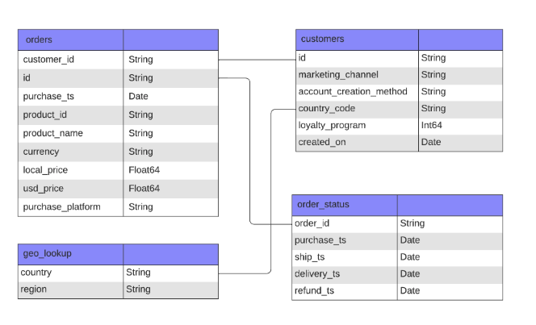

## Table of Contents

**North Star Metric:** Repeat Purchase Rate, the primary measure of E-List's long-term health, since flat AOV across four years shows growth must come from customers buying more often, not spending more per order. 

**Core KPIs:**
1. [Sales Trends](#sales-trends) - Revenue and AOV over time, isolating real growth from pandemic-driven spikes.
2. [Product Performance](#product-performance) - Revenue and refund rate by product, identifying top drivers and risk areas.
3. [Loyalty Program](#loyalty-program) - Retention rate and AOV, loyalty vs non-loyalty customers.
4. [Refund Rates](#refund-rates) - Overall and category-level refund rate, a proxy for product/listing quality.
5. [Regional Results](#regional-results) - Revenue and order volume by region, mapping growth opportunity.

 

## Sales Trends

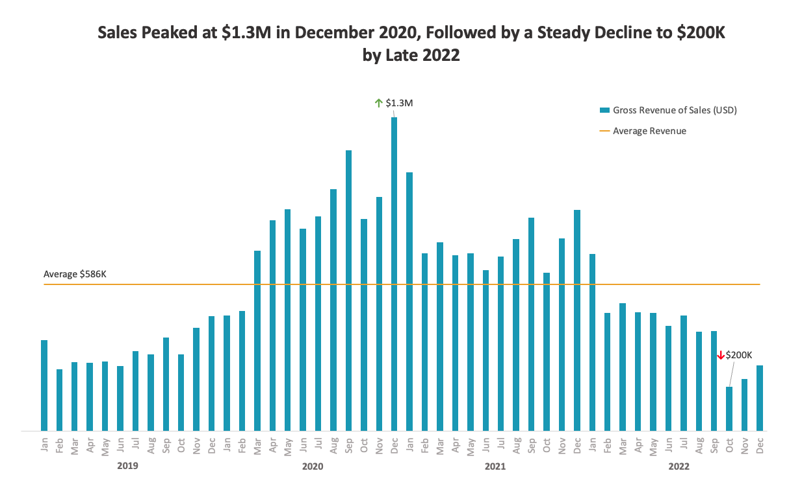

 
 

> [!NOTE]
>  ### Insights
> - Revenue peaked at <b>$1.3M in December 2020</b>, driven by pandemic-accelerated digital adoption. This is not a realistic performance benchmark. 2019 is a more reliable baseline.
> - Monthly average revenue across the period was <b>$586K</b>, with a consistent seasonal uplift every <b>Q3-Q4 (Sept - Nov)</b>.
> - AOV stayed stables at <b>$207-$345</b> across all four years, meaning growth strategies should target purchase frequency, not order size.
> - February and October are recurring dip each year..

 
 

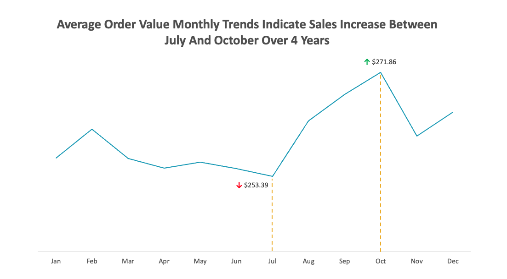

 
 

> [!TIP]
> ### Recommendations
> - Launch Q3-Q4 campaigns in <b>late August</b> to capture demand ahead of the November rush; test a mid-year summer promo to extend the peak into Q3.
> - Run tactical promotions or loyalty incentives in <b>February and October</b> to offset seasonal dips.
> - Exclude <b>March 2020</b> from all benchmarking. Flag it clearly in reporting so it doesn't distort targets.

 
 

## Product Performance

> [!NOTE]
>  ### Insights
> - Top 3 revenue drivers: <b>27in 4K Gaming Monitor, Apple AirPods, MacBook Air.</b>
> - The <b>Apple iPhone underperforms</b> on both revenue and units sold, despite AirPods and MacBook Air performing strongly in the same Apple-aligned customer base.
> - The <b>Charging Cable</b> selss high volume but low revenue per unit. A natural bundling/cross-sell candidate.
> - <b>Laptop refund rates</b> (ThinkPad 11.8%, MacBook Air 11.4%) are more than double the 5% portfolio average.

 
 

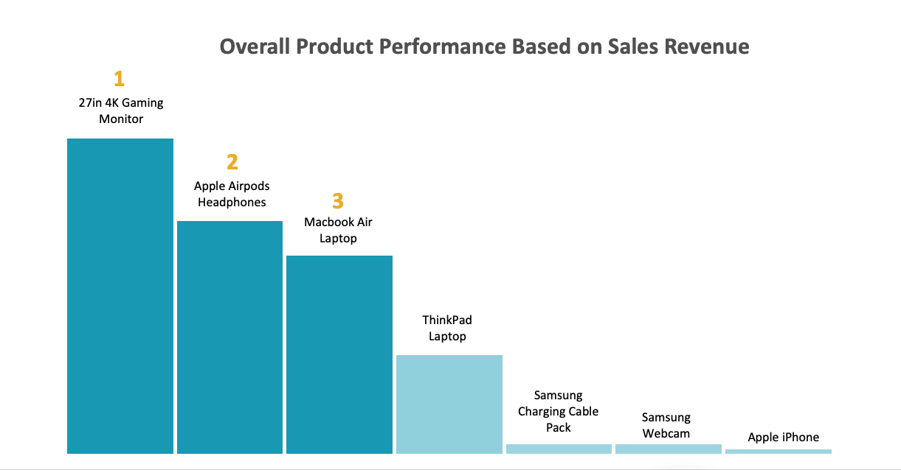
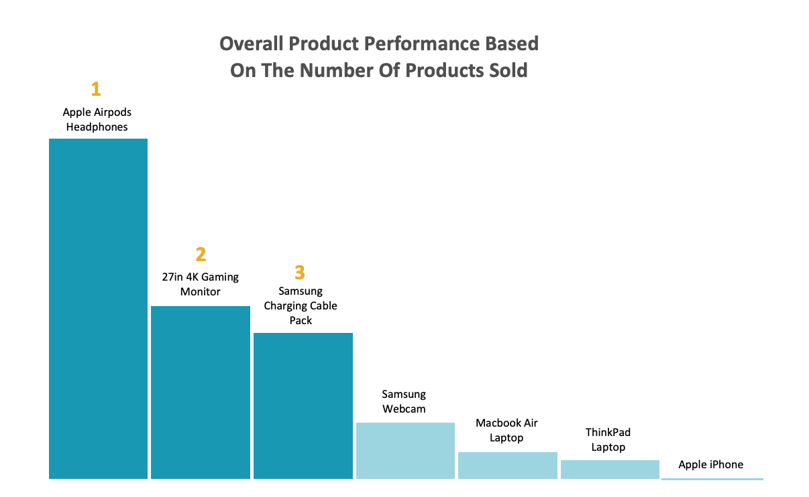

 
 

> [!TIP]
> ### Recommendations
> - Protect the top 3 products with strong inventory, prominent placement, and loyalty-reward inclusion. ANy decline here has outsized revenue impact.
> - Bundle the Charging Cable at checkout with high-ticket items to lift AOV passively.
> - Run a <b>pricing and visibility audit on the iPhone</b>. Likely causes are uncompetitive pricing vs.carriers/retailers or low listing visibility.
> - Investigate laptop refund drivers (descriptions, expectations, post-purchase support) given their high value and elevated return rate.

 
 

## Loyalty Program

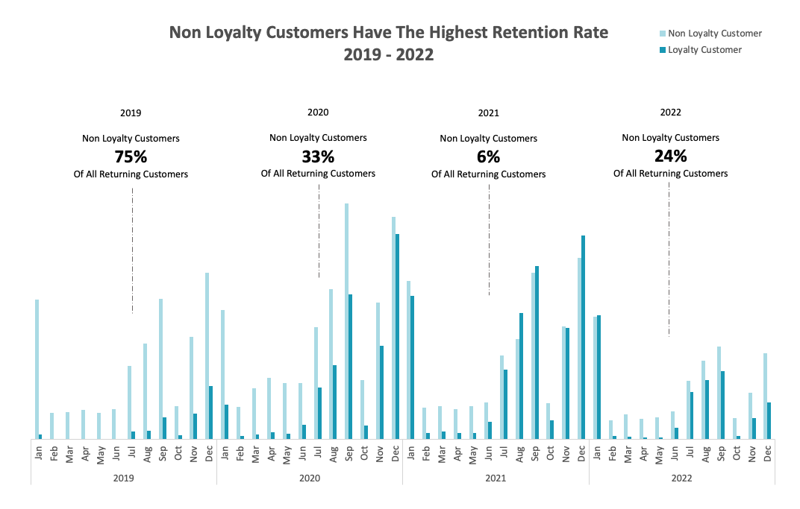

 
 

> [!NOTE]
>  ### Insights
> - Retention gap between members and non-members narrowed to just <b>6% by 2021-2022</b>. The program is working for retention.
> - It's <b>not working for spend</b>: Loyalty members had a lower AOV than non-members every year from 2019-2021.
> - <b>2022 was the first year loyalty AOV exceeded non-loyalty AOV</b> ($244.79 vs $214.11). An early positive signal, though it coincides with an overall sales decline, so it needs more data before treating as a trend.
> - Non-loyalty customer unexpectedly drove <b>75% of returning-customer behaviour in 2019.</b> A large organic-retention segment with no formal incentive.

 
 

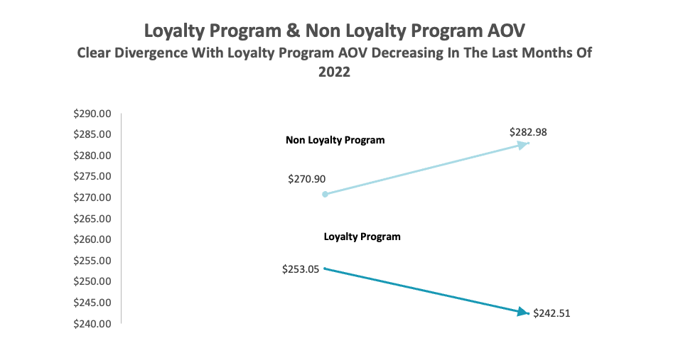

 
 

<b>Should the program continue?</b> Yes, but restructured. It's proving effective at retention, just not yet at driving spend, so the fix is to the incentive structure rather than the program itself. 

 
 

> [!TIP]
> ### Recommendations
> - Introduce <b>tiered rewards unlocked at higher spend thresholds</b>, rather than rewarding repeat visits alone.
> - Investigate what drove the high organic return rate among non-loyalty customers in 2019. Replicating it could boost retention without added program overhead.
> - Monitor the 2022 AOV reversal into 2023 before treating it as validated; it's currently one data point against a declining-sales backdrop.

 
 

## Refund Rates

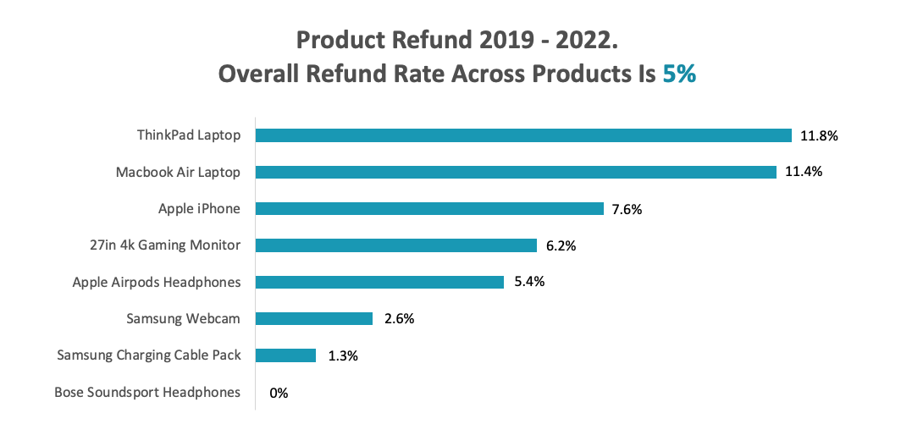

 
 

> [!NOTE]
>  ### Insights
> - The overall refund rate across four years was a healthy <b>5%</b>, in line with e-commerce benchmarks, and has been declining since a 2020-2021 pandemic-era spike (likely from less-engaged, first-time pandemic buyers).
> - <b>Laptops are the clear outlierM</b>: ThinkPad (11.8%) and MacBook Air (11.4%) vs. a 5% portfolio average, is significant given these are high-ticket items.
> - Lower-value accessories (Charging Cable, Webcam, Bose Headphones) have negligible refund rates; <b>Bose SoundSport sits a 0%.</b>
> - Apple product refund rates specifically improved sharply, from a 6-18% range in 2019 down to 0% by 2022. This is likely reflecting better listings and a more engaged post-pandemic buyer base.

 
 

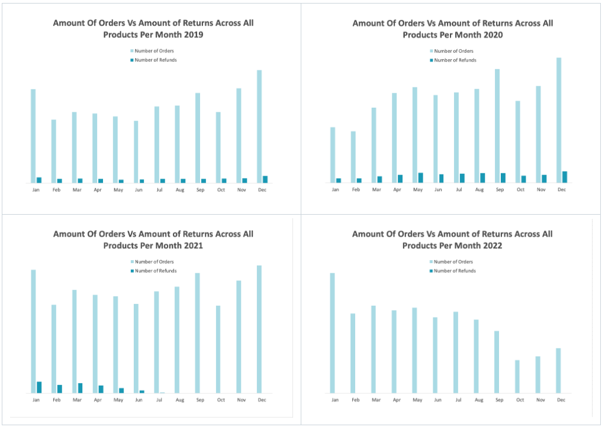
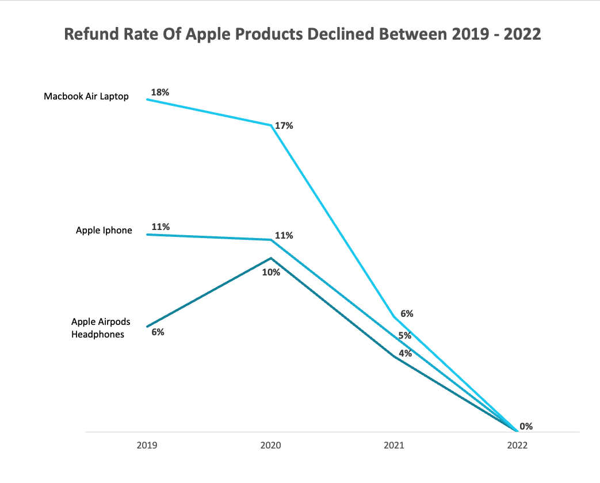

 
 

> [!TIP]
> ### Recommendations
> - The overall rata needs no intervention. It is healthy and trending down.
> - Focus refund-reduction efforts specifically on <b>laptops</b>: review product descriptions, customer expectations, and post-purchase support.
> - Use the <b>Bose SoundSport's 0% rate as a case study</b>, to understand what about its listing or experience drives zero returns and apply those lessons elsewhere.

 
 

## Regional Results

> [!NOTE]
>  ### Insights
> - <b>North America dominates:</b> $14.5M revenue, 55,803 orders. This is nearly double EMEA, the next largest region.
> - The regional hierarchy (<b>NA > EMEA > APAC > LATAM</b>) holds across both revenue and order volume, indicating a structural market position rather than a campaign effect.
> - <b>EMEA's AOV (~$252) is comparable to NA's</b>. The gap is a volume problem, not a spending problem, making it the most immediately actionable growth market.
> - <b>APAC has the highest AOV (~$275)</b> despite low volume. A smaller, higher-spending base likely limited by localisation and payment friction.
> - <b>LATAM</b> is smallest on both metrics with the lowest AOV (~$221).

 
 

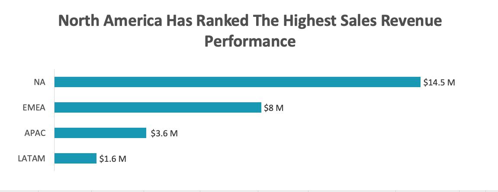
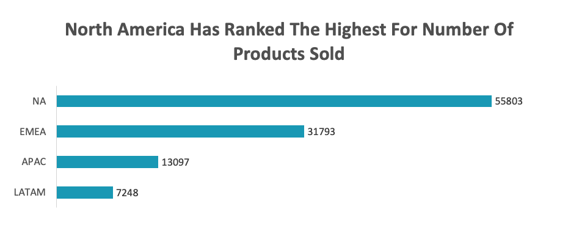

 
 

> [!TIP]
> ### Recommendations
> - <b>NA</b>: prioritise retention and AOV growth over new acquisition. A 5% AOV lift here outweighs doubling LATAM entirely.
> - <b>EMEA</b>: invest in reach and marketing spend; lowest risk, highest-probability growth region.
> - <b>APAC</b>: run small, localised pilot campaigns (local payment methods, language support) before committing significant budget.
> - <b>LATAM</b>: deprioritise short-term; monitor organically until NA/EMEA/APAC strategies mature.

